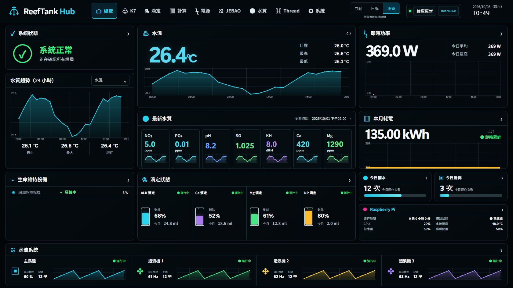
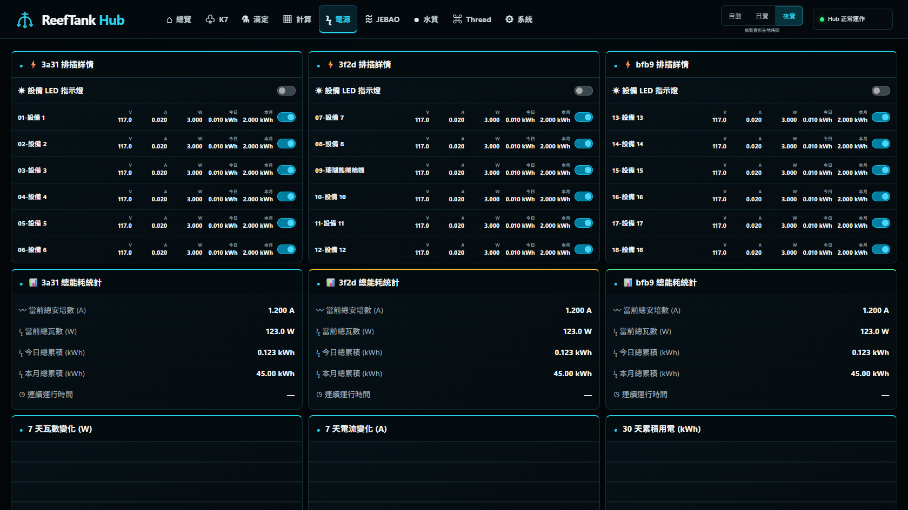
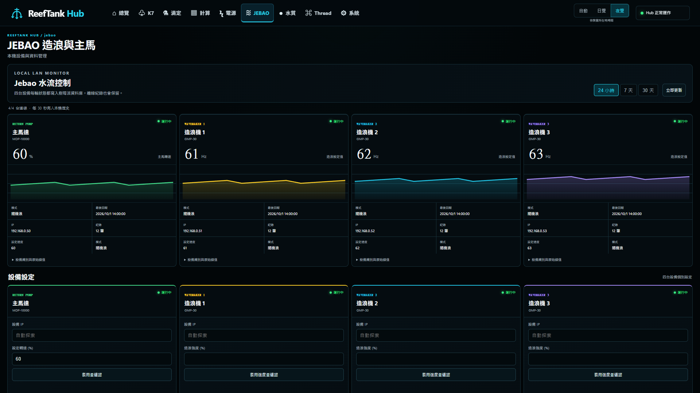
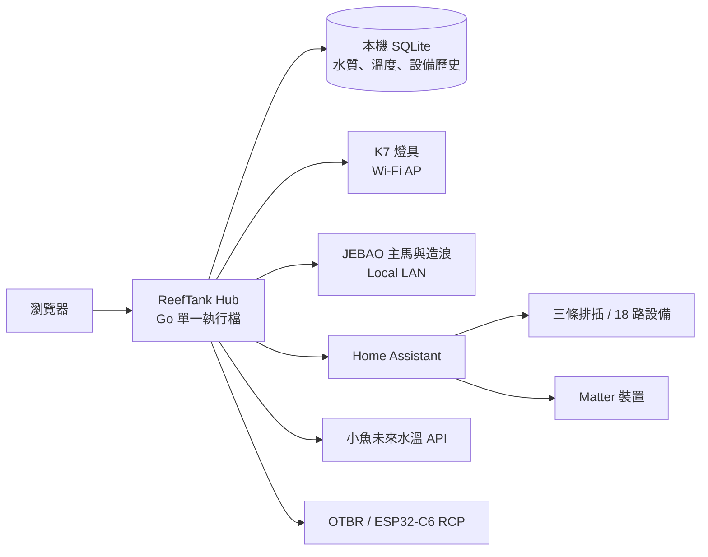

<div align="center">

# ReefTank Hub

**在 Raspberry Pi 上整合海水缸監控、設備控制、歷史資料與安全更新的本機中控台**

[](https://github.com/cp296944/reeftank-hub/releases/latest)
[](https://github.com/cp296944/reeftank-hub/actions/workflows/build-release.yml)


[最新版本](https://github.com/cp296944/reeftank-hub/releases/latest) · [完整更新紀錄](CHANGELOG.md) · [系統設計](docs/DESIGN.md) · [API 文件](docs/API.md)

</div>



ReefTank Hub 將水溫、水質、耗電、滴定、回水馬達、造浪與 Raspberry Pi 狀態集中在同一個深色儀表板。所有核心服務與歷史資料都留在區域網路內；介面提供日覽、夜覽與依所在地時間自動切換。正式版本自 **`hub-v1.0.0`** 起採用 1.x.x 版號。

> README 截圖由內建測試資料產生，不包含實際設備的 IP、MAC、Token 或水族箱紀錄。

## 主要功能

| 模組 | 能力 |
| --- | --- |
| 儀表板 | 水溫、水質、即時功率、月耗電、四頭滴定、生命維持設備與水流系統總覽 |
| K7 燈具 | 保留既有三燈連動與單燈控制介面；Hub 升級不改寫 K7 操作流程 |
| JEBAO | 一台主馬與三台造浪的四欄狀態、四欄獨立設定、24 小時／7 天／30 天歷史 |
| 電源 | 三條排插並排、18 路即時狀態、獨立開關、LED、功率與用電趨勢 |
| 水質 | NO₃、PO₄、pH、SG、KH、Ca、Mg、換水與水溫歷史，保存於本機 SQLite |
| 魔點滴定 | 四泵頭、校正、容器餘量、手動滴定、星期與分次排程、讀回確認、操作稽核 |
| Thread / Matter | ESP32-C6 RCP、OTBR 與 Home Assistant Matter 狀態整合 |
| 系統 | 服務狀態、備份、版本歷程、手動／自動 OTA 與失敗回滾 |

## 介面預覽

### 一眼掌握整缸狀態

首頁將重要資訊依操作頻率排在同一個 16:9 工作區：左側是系統與水質趨勢，中間是水溫、最新水質及四個滴定頭，右側是用電與 Raspberry Pi 狀態，底部顯示主馬與三台造浪。

### 三條排插同列監控

電源頁在寬螢幕上一排顯示三條排插，每條排插包含六路設備、即時電氣數據、開關與總能耗；下方接續顯示功率、電流及月用電趨勢。



### 四台 JEBAO 同步查看、分別設定

JEBAO 頁第一排固定呈現主馬與三台造浪的在線狀態、設定值和歷史曲線，第二排提供四台設備各自的連線與強度設定。每台設備都有獨立歷史紀錄。



## 系統架構



ReefTank Hub 負責彙整、網頁操作、歷史保存、K7、滴定與 OTA。Home Assistant 繼續負責既有設備管理、自動化與通知；Hub 不搬移或取代 HA 自動化。水溫來源可在系統頁手動選擇 Hub 直連或 HA，來源失敗時不會暗中切換。

## 頁面導覽

| 路徑 | 頁面 | 說明 |
| --- | --- | --- |
| `/` | 總覽 | 全系統即時儀表板 |
| `/K7/` | K7 燈具 | 原有 K7 完整控制介面，維持既有設計與邏輯 |
| `/dosing/` | 滴定 | 魔點四頭滴定、排程、校正與稽核 |
| `/calculator/` | 計算 | 獨立滴定計算，不傳送指令至設備 |
| `/power/` | 電源 | 三條排插、18 路設備與耗電紀錄 |
| `/jebao/` | JEBAO | 主馬與三台造浪的狀態、設定與歷史 |
| `/water/` | 水質 | 水質、換水與水溫資料 |
| `/thread/` | Thread | RCP、OTBR 與 Matter 狀態 |
| `/system/` | 系統 | 服務、備份、資料保留與更新設定 |

## 資料與控制邊界

- **K7 不受介面改版影響。** `/K7/` 保留燈具原本的頁面與操作邏輯；允許同步回舊 K7 專案的程式路徑明列於 [`sync/k7-paths.txt`](sync/k7-paths.txt)。
- **敏感憑證不進 Git。** `HA_URL`、`HA_TOKEN` 與含設備序號的 `XIAOYU_URL` 只放在 Raspberry Pi 的 root-only `/etc/reeftank-hub/ha.env`。
- **JEBAO 寫入有設備核對。** 控制前核對登錄 MAC 與產品型號，並保留 ACK／讀回結果；介面百分比代表設定值，不宣稱是實際流量計讀值。
- **滴定模擬與實機狀態分開。** BLE capability 尚未實機驗證時會明確顯示 `ble_verified=false`，避免把模擬成功誤認為設備已執行。
- **OTA 可回滾。** Pi 保留獨立 release 目錄與上一版回滾點；右上角可檢查更新、查看完整版本歷程並設定自動更新。

## Raspberry Pi 執行環境

| 項目 | 預設值 |
| --- | --- |
| 作業系統 | Raspberry Pi OS 64-bit / `linux/arm64` |
| LAN | `eth0` |
| K7 AP | `wlan0`，燈具 `192.168.4.1:8266` |
| 安裝根目錄 | `/opt/reeftank-hub` |
| systemd 服務 | `reeftank-hub.service` |
| Release tag | `hub-v*` |
| OTA 資產 | `reeftank-hub-linux-arm64` |

正式部署使用 GitHub Release 的 ARM64 單一執行檔。更新器會驗證下載結果，再切換 `current` release 並重新啟動服務；詳細流程與目錄結構收錄於 [`docs/DESIGN.md`](docs/DESIGN.md)。

## 開發與驗證

需要 Go 1.23 或更新版本。從原始碼啟動本機服務：

```bash
go test ./...
go run ./cmd/reeftank-hub --listen :8080 --data-dir ./data --proxy=
```

建立 Raspberry Pi ARM64 執行檔：

```bash
GOOS=linux GOARCH=arm64 CGO_ENABLED=0 \
  go build -trimpath -o reeftank-hub-linux-arm64 ./cmd/reeftank-hub
```

UI 可靠性測試會檢查 8 個頁面、6 種寬度、主題保存、表單輸入保留與瀏覽器錯誤：

```bash
node tests/ui-reliability.cjs
```

## 專案結構

```text
cmd/reeftank-hub/   Hub 主程式、啟動與設定流程
internal/hubweb/    儀表板頁面、樣式與前端互動
internal/httpapi/   Hub HTTP API
internal/storage/   SQLite 與歷史資料
internal/jebao/     JEBAO 探索、監控與控制
internal/updater/   OTA、版本檢查與回滾
deploy/             Raspberry Pi 安裝與服務檔案
firmware/           ESP32-C6 RCP 相關內容
tests/              端對端與 UI 可靠性驗證
docs/               API、設計與設備整合文件
```

## 文件

- [`CHANGELOG.md`](CHANGELOG.md)：從早期 K7 Pi Bridge 到 `hub-v1.0.0` 的完整版本紀錄
- [`PROGRESS.md`](PROGRESS.md)：開發進度、驗證結果與未完成項目
- [`docs/API.md`](docs/API.md)：HTTP API 路徑與資料格式
- [`docs/DESIGN.md`](docs/DESIGN.md)：架構、部署、OTA 與安全設計
- [`docs/JEBAO.md`](docs/JEBAO.md)：JEBAO 協定、設備識別與控制限制
- [`docs/DOSING_CAPABILITIES.md`](docs/DOSING_CAPABILITIES.md)：滴定功能與實機驗證狀態
- [`docs/THREAD_MATTER.md`](docs/THREAD_MATTER.md)：Thread Border Router 與 Matter 整合
- [`docs/K7_INHERITED_README.md`](docs/K7_INHERITED_README.md)：舊 K7 Pi Bridge 文件

版本頁與每個 GitHub Release 都以同一份 [`CHANGELOG.md`](CHANGELOG.md) 為準，讓離線設備與 GitHub 顯示一致的更新內容。
